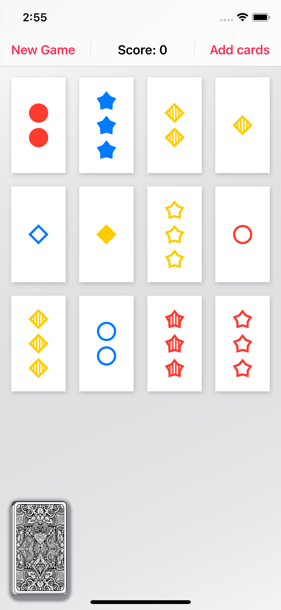

# Course Stanford CS193p 2020 - Developing Apps for iOS
> 
> Solutions for [Stanford CS193p 2020](https://cs193p.sites.stanford.edu) course assignments
>

<br/>


## Completion status

Type                                | Number  | Completion
:---                                |  :---:  |   :---:
Lectures                            |  6 / 12 |  50%
Assignment I                        |  6 / 6  | 100%
Extra credits                       |  1 / 1  | 100%
Assignment II                       |  9 / 9  | 100%
Extra credits                       |  1 / 2  |  50%
Assignment III                      | 19 / 19 | 100%
Extra credits                       |  4 / 11 |  36%


<br/>

## Set Game 

<br/>

#### Assignment III

Task 1 - 19. Make a game of Set 

> Since the 1st task sounds like "Implement a game of solo Set" and other 18 tasks also cannot be called unexacting, I'm not providing here detailed answers for each task. However you can find some comments and print output in the [Set Game](./SetGame) project I've made.
>
> I used a new feature of SwiftUI `LazyVGrid` instead of the Grid provided by Professor.
>
> This project is made with **Xcode Version 12.0 beta 2**. 
>

<div>


</div>

<br/>

---

<br/>

## Memorize Game

<br/>

#### Assignment I

Task 2. Unpredictable order

> Swift provides an easy solution to randomize Array. In the ViewModel I added a *shuffled()* method to randomize emojis to play with and in the Model a *shuffle()* method to initialize a new game with shuffled cards
>
> `let emojis = theme.emojis.shuffled()`
> 
> `cards.shuffle()`
>

<br/>

Task 3. Width and height in a certain proportion

> Applied to the ZStack of the View, because of the better solution it was commented later 
>
> `.aspectRatio(2/3, contentMode: .fit)`
>


<br/>

Task 4. Randomize number of pairs of cards

> In the 2nd Assignment it is changed for an another solution
>
> `let numberOfPairs = Int.random(in: 2...5)`

<br/>

Task 5. Adjust size of the font

> After lecture #4 a Grid is applied to the project 
>
> `.font(EmojiMemoryGame.numberOfPairs > 4 ? .callout : .largeTitle)`
>

<br/>

Extra Credit 1. 

> Solution for that was displayed earlier 
> 
> `let emojis = theme.emojis.shuffled()`
>

<br/>

---

<br/>

#### Assignment II

Task 3-5. Architect the concept of a 'theme' into the game

> 'static' properties belong to the type; a new theme can be added as an another 'static' property or by using `append(newTheme)` to the variable 'theme'. I prefer 'static' because I can see all themes in one place 

```swift
struct Theme {
    var name: String
    var emojis: [String]
    var cardsNumber: Int?
    var color: Color
    
    static let cats = Theme(name: "Cats", emojis: ["😺", "😸", "😹", "😻", "🙀", "😿", "😾", "😼"], color: .yellow)
    ... // other themes in the project //
    
    static var themes = [cats, techno, zodiac, animals, vegetables, flowers]
}
```
> Initialize a theme property in ViewModel 
>

```swift

class EmojiMemoryGame: ObservableObject {
    ...
    var theme: Theme

        init() {
            let theme = Theme.themes.randomElement()!
            self.theme = theme
            model = EmojiMemoryGame.createMemoryGame(with: theme)
            }
            ...
}
```

<br/>

Task 6. Add 'New Game' button
> Add a Reset button in ViewModel and then use it functionality in the View 


```swift
// ViewModel
    func resetGame() {
        theme = Theme.themes.randomElement()!
        model = EmojiMemoryGame.createMemoryGame(with: theme)
    }

// View 
    Button(action: {
        self.viewModel.resetGame()
     }) {
        Text("New Game")
     }
```

<br/>

Task 7. Display a theme in UI

> `Text(viewModel.theme.name)`
>

<br/>

Task 8. Giving and penalizing points

> The logic should be implemented in the Model. To the 'Card' struct we need to add a new boolean property 'alreadyBeenSeen' that will help us to penalize when cards haven't been matched during the 1st try.
>
> In the `choose(card:)` method replace the 'indexOfTheOneAndOnlyFaceUpCard' index which was created in the 4th lecture with the array 'faceupCardIndeces'. The new element will contain up to 2 indeces and flip cards face down when they don't match.
>
> Additional comments in the project.
>

```swift
mutating func choose(card: Card) {

    let faceupCardIndeces = cards.indices.filter { cards[$0].isFaceUp }
    
    \\\ third tap; when two cards are opened, update there Seen status and flip them; restart
    
    if faceupCardIndeces.count > 1 {
        for index in cards.indices {
            if cards[index].isFaceUp {
                cards[index].alreadyBeenSeen = true
                cards[index].isFaceUp = false
            }
        }
    }
    
    /// when the 1st and then the 2nd card has chosen which hasn't been matched yet
    if let chosenIndex = cards.firstIndex(matching: card), !cards[chosenIndex].isFaceUp, !cards[chosenIndex].isMatched {
        
        /// 1st tap: choose card - > flip the 1st card;
        /// 2nd tap: choose another card (start over func) -> flip the second card but in faceUpIndeces will be only one index still
        cards[chosenIndex].isFaceUp = true
        if faceupCardIndeces.count == 1 {
            
            if cards[faceupCardIndeces[0]].content == cards[chosenIndex].content {
                cards[chosenIndex].isMatched = true
                cards[faceupCardIndeces[0]].isMatched = true
                
                /// add two points for match even if cards had been seen
                score += 2
            } else {
                
                /// penalizing 1 point for each card that has been seen but hasn't been matched yet
                if cards[chosenIndex].alreadyBeenSeen {
                    score -= 1
                }
                if cards[faceupCardIndeces[0]].alreadyBeenSeen {
                    score -= 1
                }
            }
        }
    }
}
```

<br/>

Task 9. Display the score in UI

> Add score as a variable in ViewModel and then display in the VIew 
>
> `var score: Int { model.score }` // ViewModel
>
> `Text("\(viewModel.score)")` // View
>

<br/>

Extra Credit 1. Support a gradient as the 'color' for a theme

> In the View (because it's a visual improvement) I added a computed property to make a gradient from the theme's color. 'CardView' requires now two values: `card` and `themeColor: LinearGradient`, so that color can be used to design appereance of cards
>

```swift
    var themeColor: LinearGradient {
        return LinearGradient(gradient: 
            Gradient(colors: [viewModel.theme.color, 
            viewModel.theme.color.opacity(0.4)]), 
            startPoint: .topLeading, 
            endPoint: .bottomTrailing)
    }
```

<br/>

## Ideas I liked from the Course
1. If Model can be made with different types, add Generics to it.
2. ViewModel establishes a specific type of data.
3. Static function can be used to create a specific ViewModel from Model; that function can be used to reset the game.
4. Use 'Drawing Constraints' to avoid setting values directly in a code.
5. Make variable of the model 'private' in ViewModel and send to the View an another copy of it. Mark 'private' all properties and functions that shouldn't be accessible and 'private(set)' - that shouldn't be changeable nowhere else.
6. Custom ViewModifiers, Shapes can help make code much reusable. 

<br/>


---
<br/>

## Note
Presented code is my attempt to solve required tasks of the Stanford course. I'd appreciate any features and improvement you have to share. Feel free to [reach me out](mailto:Valerika.Hello@gmail.com)  😊

<br/>

## Credits 
A playing card back image used in the Set Game is made by [macrovector](https://www.freepik.com/free-vector/undefined). Construction of the MVVM and the stripped pattern is based on the amazing implementation by [Antonio J Rossi](https://github.com/antoniojrossi) in the Set Game.
